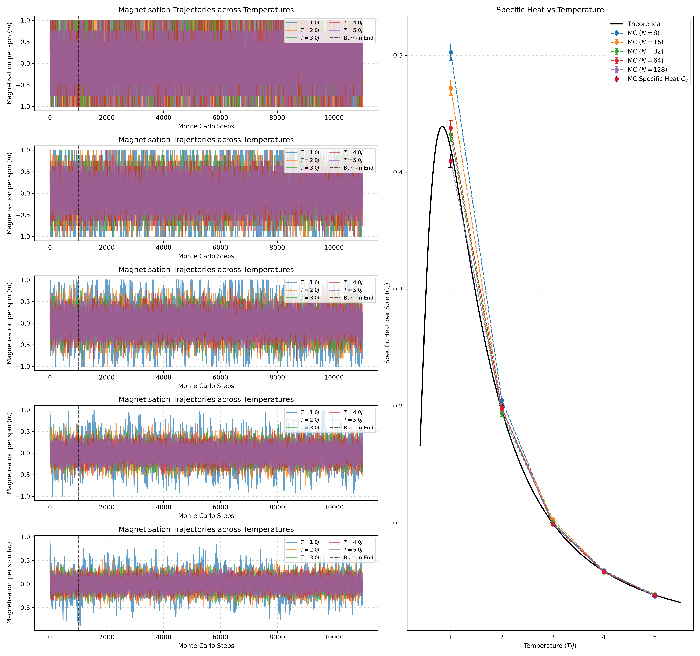
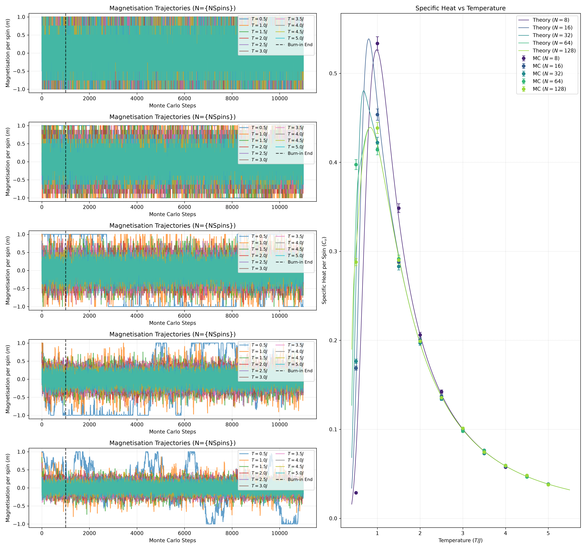
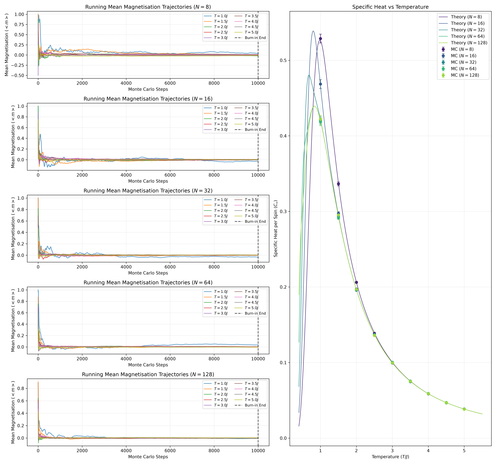

# URSS-project-2026

<b>Click to expand Simulation Data Table</b>

| N | T | Avg. E | Cv | F (approx) |
| :---: | :---: | :---: | :---: | :---: |
| 8 | 1 | -0.8273 | 0.5027 | -1.5204 |
| 8 | 2 | -0.4679 | 0.2050 | -1.8542 |
| 8 | 3 | -0.3243 | 0.0999 | -2.4037 |
| 8 | 4 | -0.2441 | 0.0595 | -3.0167 |
| 8 | 5 | -0.1946 | 0.0372 | -3.6603 |
| 16 | 1 | -0.7684 | 0.4721 | -1.4615 |
| 16 | 2 | -0.4622 | 0.1965 | -1.8485 |
| 16 | 3 | -0.3185 | 0.1030 | -2.3980 |
| 16 | 4 | -0.2475 | 0.0582 | -3.0201 |
| 16 | 5 | -0.1927 | 0.0379 | -3.6584 |
| 32 | 1 | -0.7619 | 0.4322 | -1.4550 |
| 32 | 2 | -0.4611 | 0.1939 | -1.8474 |
| 32 | 3 | -0.3222 | 0.1009 | -2.4016 |
| 32 | 4 | -0.2446 | 0.0577 | -3.0172 |
| 32 | 5 | -0.1979 | 0.0388 | -3.6637 |
| 64 | 1 | -0.7631 | 0.4378 | -1.4562 |
| 64 | 2 | -0.4602 | 0.1985 | -1.8465 |
| 64 | 3 | -0.3225 | 0.0988 | -2.4020 |
| 64 | 4 | -0.2451 | 0.0579 | -3.0177 |
| 64 | 5 | -0.1986 | 0.0381 | -3.6643 |
| 128 | 1 | -0.7655 | 0.4096 | -1.4586 |
| 128 | 2 | -0.4610 | 0.1978 | -1.8473 |
| 128 | 3 | -0.3203 | 0.0989 | -2.3998 |
| 128 | 4 | -0.2439 | 0.0588 | -3.0165 |
| 128 | 5 | -0.1977 | 0.0379 | -3.6635 |

\
Initial results show that the data does converge to the thermodynamic limit as N increases, however $C_v$ obviously overshoots at small N 
\
$C_v=(\frac{J}{T})^2sech^2(\frac{J}{T})$ used assumes $N \rightarrow \infty$ (thermodynamic limit). Why did I do that? idk.
\

Have used equation (8) from https://arxiv.org/pdf/2208.04751 

\
Ammended code to get the theoretical value from 2nd derivatives with more data points because why not:

<b>Click to expand Simulation Data Table</b>

| N | T | Avg. E | Cv | F (approx) |
| :---: | :---: | :---: | :---: | :---: |
| 8 | 0.5 | -0.9982 | 0.0287 | -1.3448 |
| 8 | 1.0 | -0.8148 | 0.5336 | -1.5079 |
| 8 | 1.5 | -0.6006 | 0.3485 | -1.6403 |
| 8 | 2.0 | -0.4655 | 0.2061 | -1.8518 |
| 8 | 2.5 | -0.3771 | 0.1423 | -2.1100 |
| 8 | 3.0 | -0.3221 | 0.1002 | -2.4016 |
| 8 | 3.5 | -0.2847 | 0.0750 | -2.7107 |
| 8 | 4.0 | -0.2451 | 0.0575 | -3.0177 |
| 8 | 4.5 | -0.2235 | 0.0472 | -3.3427 |
| 8 | 5.0 | -0.2007 | 0.0385 | -3.6664 |
| 16 | 0.5 | -0.9891 | 0.1688 | -1.3356 |
| 16 | 1.0 | -0.7692 | 0.4536 | -1.4624 |
| 16 | 1.5 | -0.5776 | 0.2881 | -1.6173 |
| 16 | 2.0 | -0.4645 | 0.2004 | -1.8508 |
| 16 | 2.5 | -0.3764 | 0.1371 | -2.1092 |
| 16 | 3.0 | -0.3224 | 0.1002 | -2.4018 |
| 16 | 3.5 | -0.2741 | 0.0764 | -2.7001 |
| 16 | 4.0 | -0.2482 | 0.0585 | -3.0207 |
| 16 | 4.5 | -0.2178 | 0.0480 | -3.3370 |
| 16 | 5.0 | -0.2000 | 0.0384 | -3.6657 |
| 32 | 0.5 | -0.9881 | 0.1764 | -1.3347 |
| 32 | 1.0 | -0.7649 | 0.4222 | -1.4580 |
| 32 | 1.5 | -0.5819 | 0.2830 | -1.6217 |
| 32 | 2.0 | -0.4605 | 0.1969 | -1.8468 |
| 32 | 2.5 | -0.3791 | 0.1342 | -2.1120 |
| 32 | 3.0 | -0.3240 | 0.0991 | -2.4034 |
| 32 | 3.5 | -0.2799 | 0.0728 | -2.7060 |
| 32 | 4.0 | -0.2454 | 0.0588 | -3.0180 |
| 32 | 4.5 | -0.2173 | 0.0470 | -3.3364 |
| 32 | 5.0 | -0.1975 | 0.0383 | -3.6632 |
| 64 | 0.5 | -0.9700 | 0.3974 | -1.3166 |
| 64 | 1.0 | -0.7628 | 0.4142 | -1.4560 |
| 64 | 1.5 | -0.5820 | 0.2916 | -1.6217 |
| 64 | 2.0 | -0.4629 | 0.1988 | -1.8492 |
| 64 | 2.5 | -0.3781 | 0.1354 | -2.1110 |
| 64 | 3.0 | -0.3199 | 0.0979 | -2.3993 |
| 64 | 3.5 | -0.2779 | 0.0763 | -2.7040 |
| 64 | 4.0 | -0.2438 | 0.0594 | -3.0164 |
| 64 | 4.5 | -0.2203 | 0.0466 | -3.3395 |
| 64 | 5.0 | -0.1974 | 0.0381 | -3.6631 |
| 128 | 0.5 | -0.9607 | 0.2879 | -1.3072 |
| 128 | 1.0 | -0.7615 | 0.4386 | -1.4547 |
| 128 | 1.5 | -0.5829 | 0.2902 | -1.6227 |
| 128 | 2.0 | -0.4618 | 0.1991 | -1.8481 |
| 128 | 2.5 | -0.3805 | 0.1356 | -2.1133 |
| 128 | 3.0 | -0.3226 | 0.1011 | -2.4021 |
| 128 | 3.5 | -0.2786 | 0.0743 | -2.7046 |
| 128 | 4.0 | -0.2462 | 0.0593 | -3.0188 |
| 128 | 4.5 | -0.2207 | 0.0481 | -3.3399 |
| 128 | 5.0 | -0.1978 | 0.0378 | -3.6636 |

The error bars for this plot are calculated incorrectly - initially the error bars were calculated using $e=C_v\sqrt{\frac{2}{N-1}}$ which assumes all the samples are independent. This is not the case, so the error was recalculated using autocorrelation time which estimates the effective number of independent samples (https://dfm.io/posts/autocorr/).

\
Additionally, the plots for the magetisation trajectories are hard to visually understand what is going on. To ammend this, the plots were changed to calculated the running mean of the magnetisation since the value should stabilise to 0. When doing this, the $T=0.5J$ plot did not stabilise due to the temperature being too low and so the lowest value of temperature sampled changed to $T=1J$

<b>Click to expand Simulation Data Table</b>

| $N$ | $T/J$ | Avg. Energy $\langle E \rangle$ | Specific Heat $C_v$ | Approx. Free Energy $F$ | Running Mean $\langle m(t) \rangle$ |
| :---: | :---: | :---: | :---: | :---: | :---: |
| **8** | 1.0 | -1.8181 | 0.5287 | -2.5113 | -0.0035 |
| **8** | 1.5 | -1.5983 | 0.3364 | -2.6380 | 0.0062 |
| **8** | 2.0 | -1.4639 | 0.2062 | -2.8502 | -0.0030 |
| **8** | 2.5 | -1.3820 | 0.1388 | -3.1149 | -0.0038 |
| **8** | 3.0 | -1.3231 | 0.0993 | -3.4026 | -0.0015 |
| **8** | 3.5 | -1.2763 | 0.0754 | -3.7023 | -0.0016 |
| **8** | 4.0 | -1.2466 | 0.0592 | -4.0192 | -0.0023 |
| **8** | 4.5 | -1.2195 | 0.0467 | -4.3387 | -0.0022 |
| **8** | 5.0 | -1.1979 | 0.0385 | -4.6637 | -0.0015 |
| **16** | 1.0 | -1.7690 | 0.4686 | -2.4622 | 0.0074 |
| **16** | 1.5 | -1.5828 | 0.2974 | -2.6225 | 0.0087 |
| **16** | 2.0 | -1.4630 | 0.1974 | -2.8493 | 0.0029 |
| **16** | 2.5 | -1.3806 | 0.1373 | -3.1135 | -0.0010 |
| **16** | 3.0 | -1.3218 | 0.0999 | -3.4012 | -0.0015 |
| **16** | 3.5 | -1.2785 | 0.0755 | -3.7045 | 0.0005 |
| **16** | 4.0 | -1.2455 | 0.0586 | -4.0181 | -0.0023 |
| **16** | 4.5 | -1.2175 | 0.0471 | -4.3367 | -0.0004 |
| **16** | 5.0 | -1.1971 | 0.0386 | -4.6628 | 0.0008 |
| **32** | 1.0 | -1.7622 | 0.4204 | -2.4553 | 0.0074 |
| **32** | 1.5 | -1.5843 | 0.2937 | -2.6240 | 0.0010 |
| **32** | 2.0 | -1.4618 | 0.1958 | -2.8481 | -0.0035 |
| **32** | 2.5 | -1.3801 | 0.1364 | -3.1130 | -0.0002 |
| **32** | 3.0 | -1.3210 | 0.0995 | -3.4004 | 0.0002 |
| **32** | 3.5 | -1.2767 | 0.0747 | -3.7027 | 0.0011 |
| **32** | 4.0 | -1.2451 | 0.0588 | -4.0177 | 0.0008 |
| **32** | 4.5 | -1.2189 | 0.0466 | -4.3380 | 0.0006 |
| **32** | 5.0 | -1.1982 | 0.0385 | -4.6640 | -0.0004 |
| **64** | 1.0 | -1.7616 | 0.4186 | -2.4547 | 0.0044 |
| **64** | 1.5 | -1.5834 | 0.2916 | -2.6231 | 0.0014 |
| **64** | 2.0 | -1.4617 | 0.1971 | -2.8480 | 0.0011 |
| **64** | 2.5 | -1.3799 | 0.1367 | -3.1128 | 0.0008 |
| **64** | 3.0 | -1.3218 | 0.1004 | -3.4013 | 0.0014 |
| **64** | 3.5 | -1.2784 | 0.0756 | -3.7045 | 0.0004 |
| **64** | 4.0 | -1.2452 | 0.0591 | -4.0178 | 0.0003 |
| **64** | 4.5 | -1.2188 | 0.0472 | -4.3379 | -0.0008 |
| **64** | 5.0 | -1.1976 | 0.0385 | -4.6633 | -0.0004 |
| **128** | 1.0 | -1.7618 | 0.4220 | -2.4549 | -0.0100 |
| **128** | 1.5 | -1.5840 | 0.2953 | -2.6238 | 0.0003 |
| **128** | 2.0 | -1.4619 | 0.1969 | -2.8482 | 0.0000 |
| **128** | 2.5 | -1.3801 | 0.1359 | -3.1130 | 0.0002 |
| **128** | 3.0 | -1.3215 | 0.0996 | -3.4009 | 0.0003 |
| **128** | 3.5 | -1.2786 | 0.0751 | -3.7047 | -0.0008 |
| **128** | 4.0 | -1.2452 | 0.0588 | -4.0178 | 0.0002 |
| **128** | 4.5 | -1.2188 | 0.0470 | -4.3379 | 0.0004 |
| **128** | 5.0 | -1.1978 | 0.0382 | -4.6636 | 0.0006 |

Including the average magnetisation over time, it is now more clear that this value stabilises to 0 as temperature and number of spins in the chain increases.